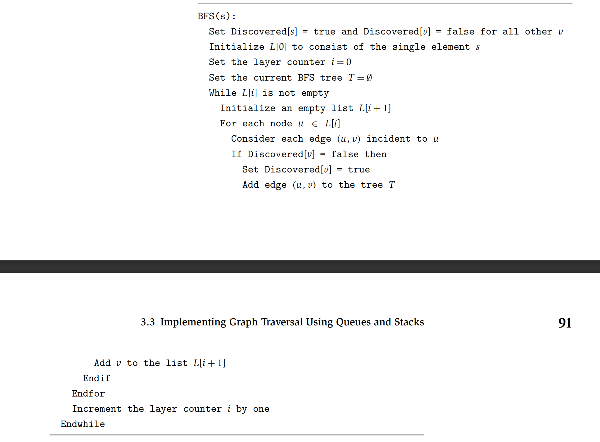
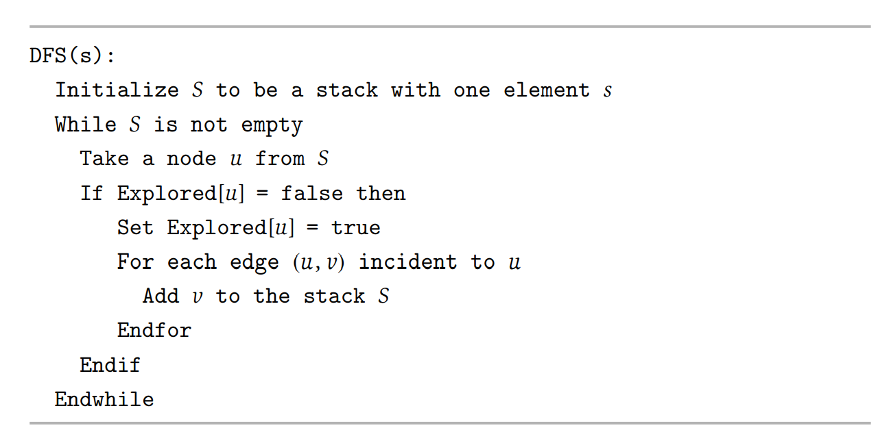
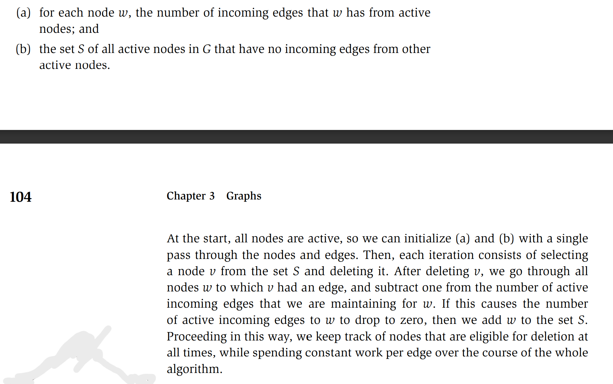

**Strongly Connected**
For every two nodes $u$ and $v$, there is a path from $u$ to $v$,
and a path from $v$ to $u$.

**(3.2)**
Let $G$ be an undirected graph on $n$ nodes, Any two of the statements implies the third:
- $G$ is connected
- $G$ does not contain a cycle.
- $G$ has $n - 1$ edges. 

## Breath-First Search
**(3.3)**
For each $j >= 1$, layer $L_j$ produced by BFS consists of all nodes at a distance exactly $j$ from $s$.
There is a path from $s$ to $t$ iff $t$ appears in the same layers.

**(3.4)**
Let $T$ be a BFS tree, let $x$ and $y$ be nodes in $T$ belonging to layers $L_i$ and $L_j$ respectively, and $(x, y)$ be an edge of $G$. Then $i$ and $j$ differ by at most 1.

Suppose we continue growing the set $R$ until there are no more edges leading oiut  of $R$, in other words, we run the following algorithm:

---
$R$ will consist of nodes to which $s$ has a path 
Initially $R = {s}$ 
While there is an edge $(u, v)$ where $u\isin R$, and $v\notin R$ 
&emsp; Add $v$ to $R$ 
EndWhile 

---

**(3.5)**
The set $R$ produced at the end of the algorithm is precisely the connected component of $G$
contaning $s$. 

## Deep-First Search

---
DFS($u$): 
&emsp;Mark $u$ as "Explored" and add $u$ to $R$ 
&emsp;For each edge $(u, v)$ incident to $u$ 
&emsp;&emsp;If $v$ is not marked "Explored" then 
&emsp;&emsp;&emsp;Recursively invoke DFS($v$) 
&emsp;&emsp;Endif 
&emsp;Endfor 

---

**(3.6)**
For a given recursive call $DFS(u)$, all nodes that are marked "Explored" between the invocation
and end of this recursive call are descendants of $u$ in $T$.
**(3.7)**
Let $T$ be a depth-first search tree, let $x$ and $y$ be nodes in $T$, and let $(x, y)$ be an edge
of $G$ that is not an edge of $T$. Then one of $x$ or $y$ is an ancestor of the other.

**(3.8)**
For any two nodes $s$ and $t$ in a graph, their connected components are either identical or disjoint.
**(3.9)**
$$\sum_{v\isin V}{n_v} = 2m$$
**(3.10)**
The adjacency matrix representation of a graph requires $O(n^2)$ space,
while the adjacency list representation requires only $O(m+n)$ space.

## Implementation
### BFS

**(3.11)**
The above implementation of the BFS algorithm runs in time O(m + n)
(i.e., linear in the input size), if the graph is given by the adjacency list
representation.

### DFS

**(3.12)**
The above algorithm implements DFS, in the sense that it visits the
nodes in exactly the same order as the recursive DFS procedure in the previous
section (except that each adjacency list is processed in reverse order).

**(3.13)**
The above implementation of the DFS algorithm runs in time $O(m + n)$
(i.e., linear in the input size), if the graph is given by the adjacency list
representation.

**(3.14)**
If a graph G is bipartite, then it cannot contain an odd cycle.

**(3.15)**

Let $G$ be a connected graph, and let $L1, L2,$... be the layers produced
by BFS starting at node s. Then exactly one of the following two things must
hold.
(i) There is no edge of $G$ joining two nodes of the same layer. In this case $G$
is a bipartite graph in which the nodes in even-numbered layers can be
colored red, and the nodes in odd-numbered layers can be colored blue.
(ii) There is an edge of $G$ joining two nodes of the same layer. In this case, $G$
contains an odd-length cycle, and so it cannot be bipartite.

If $u\rightarrow v$ and $v\leftarrow u$, then $u$ and $v$ are **mutually reachable**.

**(3.16)**
If $u$ and $v$ are mutually reachable, and $v$ and $w$ are mutually reachable,
then $u$ and $w$ are mutually reachable.

**(3.17)**
For any two nodes $s$ and t$$ in a directed graph, their strong components
are either identical or disjoint.

If a directed graph has no cycles, we call it **a directed acyclic graph**, 
or a **DAG** for short.

**(3.19)** In every DAG $G$, there is a node $v$ with no incoming edges.

**(3.20)** If $G$ is a DAG, then $G$ has a topological ordering.

---
To compute a topological ordering of $G$: 
Find a node $v$ with no incoming edges and order it first 
Delete $v$ from $G$ 
Recursively compute a topological ordering of $G−\{v\}$ 
and append this order after $v$ 
---

