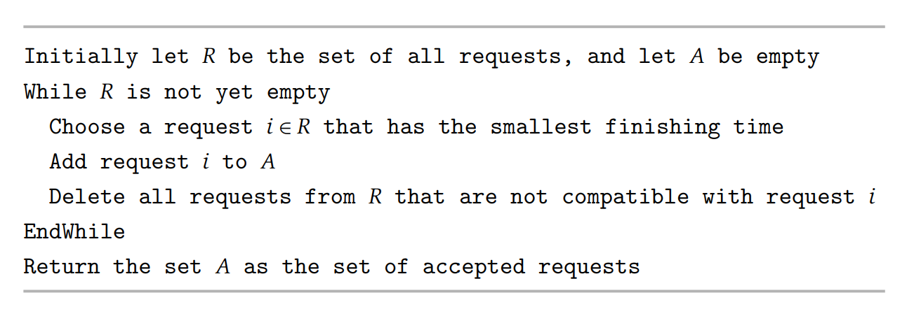
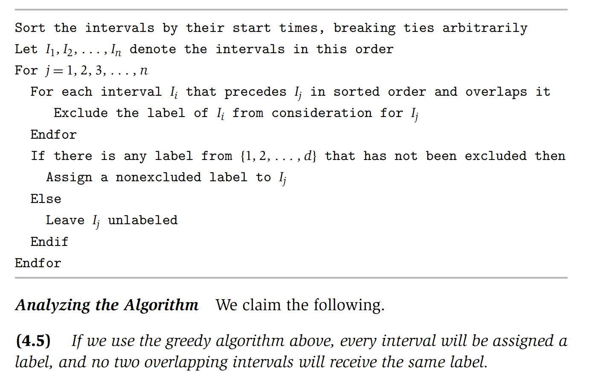

**Interval Scheduling** 

**(4.1)** $A$ is a compatible set of requests.
> If the result set overlaps, then the result is not compatible. 

**(4.2)**
Let $O$ be the an optimal set of intervals. Let: 
$$A = \{i_1, ..., i_k\}$$
$$O = \{j_1, ..., j_m\}$$
Notice that: $ |A| = k$ and $|O| = m $. 
For all indices $r \leq k$, we have: $f(i_r) \leq f(j_r)$.

Time Complexity: $O(n\log(n))$

**Scheduling all Intervals**
A.k.a Interval Partioning Problem.

**(4.4)**
In any instance of Interval Partitioning, the number of resources needed is at 
needed is at least the depth of the set of intervals.

