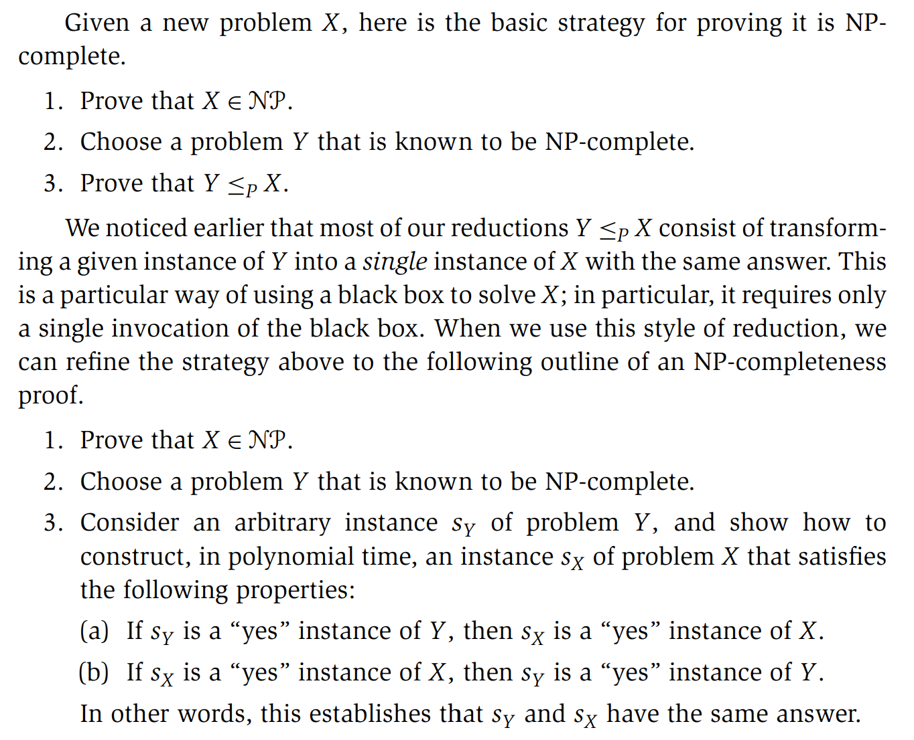

**NPC**  
(i) $X\in NP$ 
(ii) $\forall Y\in NP, Y\leq_{P}X$

**(8.12)** 
Suppose $X$ is an $NPC$ problem, Then $X$ is solvable in polynomial time iff $P = NP$.

**Circuit Satisfiability** 
**(8.13)** 
Circuit Satisfiability is $NPC$ problem.

**(8.14)** 
If $Y$ is an $NPC$ problem, and $X$ is a problem in $NP$ with the property that $Y\leq_P$X,
then $X$ is $NPC$.

**(8.15)** 
3-Satisfiability is $NPC$.

**(8.16)** 
All of the following problems are $NPC$:
Independent Set, Set Packing, Vertex Cover, Set Cover. 

Strategy for Proving NPC.
