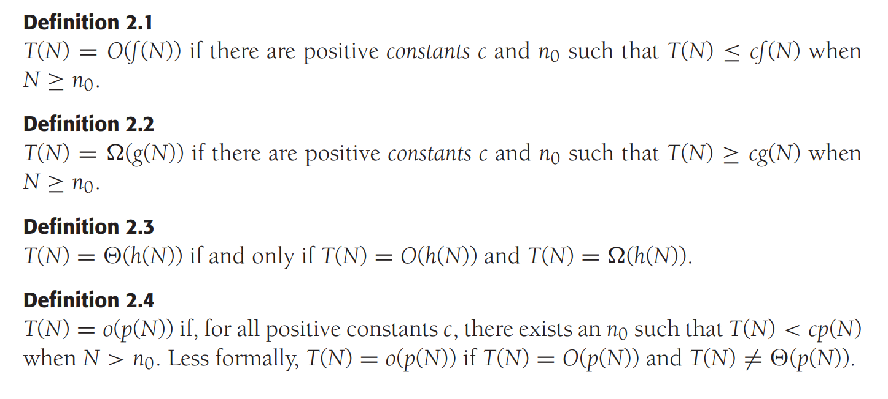

# Algorithm Analysis
## Mathematical Background


$O(f(N))$ is Big-O Notation.
If $T(N)=O(f(N))$, we say, $f(N)$ is an **upper bound** on $T(N)$,
since it implies that $f(N)=\Omega(T(N))$, we say that $T(N)$ is a 
**lower bound** on $f(N)$

Here are some rules:

**Rule1**

If $T_1=O(f(N))$ and $T_2(N)=O(g(N))$, then:

1. $T_1(N)+T_2(N)=O(f(N)+g(N))$
    or $O(\max(f(N), g(N)))$
2. $T_1(N)T_2(N) = O(f(N)g(N))$

**Rule2**

If $T(N)$ is a polynomial of deg $k$, then $T(N) = \Theta(N^k)$

**Rule3**

$\log_k{N} = O(N)$ $\forall$  constant $k$

We can also use the L'Hospital's Rule:
$\lim_{N\rightarrow\infty}{f(N)/g(N)}$:

1. lim = 0:         $f(N)=o(g(N))$
2. lim != 0:        $f(N)=\Theta(g(N))$
3. lim is $\infty$: $g(N)=o(f(N))$
4. lim does exist:  There is no relation

## General Rules

### Rule1-FOR loops
The running time of a `for` loop is at most the running time of the statements inside the `for` loop(including tests) times the number of iterations.
e.g.
The following program fragment is $O(N^2)$
```cpp
for (int i = 0; i < n; ++i) {
    for (int j = 0; j < n; ++j) {
        ++k;
    }
}
```
### Rule2-Nested loops
These just add(which means that the maximum is the one that counts)
As an example, the following program fragment, which $O(N)$ work followed by work, is also $O(N^2)$
```cpp
for (i = 0; i < n; i++) 
    a[i] = 0;
for (int i = 0; i < n; ++i) {
    for (int j = 0; j < n; ++j)
        a[i] += a[j] + i + j;
}
```
### Rule3-Consecutive Statements

### Rule4- If/Else
```
if(condition)
    S1
else
    S2
```
The running time of an `If/Else` statement is never more than the running time of the test plus the larger of the running times of S1 and S2

## Maximum Subsequences Sum Problem

### Given integers $A_1, A_2, ..., A_N$, find the maximum value of $\sum_{k=i}^{j}A_k$
#### (For convenience, the maximum subsequence sum is 0 if all the integers are negative.)
e.g. For input $\{-2, 11, -4, 13, -5, -2\}$, the answer is 20($A_2$ through $A_4$)
Clearly, this can be an overestimate, in some cases, but it is never an underestimate
Algorithm 1:
```cpp
int maxSubSum1(const vector<int> & a) {
    int maxSum = 0;

    for (int i = 0; i < a.size(); ++i) {
        for (int j = i; j < a.size(); ++j) {
            int thisSum = 0;
            for (int k = i; k <= j; ++k) {
                thisSum += a[k];
            }
            if (thisSum > maxSum) 
                maxSum = thisSum;
        }
    }
    return maxSum;
}
```
> The running time is $O(N^3)$, more precisely, it is $\Theta(N^3)$

Algorithm 2
```cpp
int maxSubSum2(const vector<int> &a) {
    int maxSum = 0;

    for (int i = 0; i < a.size(); ++i) {
        int thisSum = 0;
        for (int j = 0; j < a.size(); ++j) {
            thisSum += a[j];
            if (thisSum > maxSum)
                maxSum = thisSum;
        }
    }
    return maxSum;
}
```
> The running time is $O(N^2)$ 

Algorithm 3

*Use **Divide-and-Conquer** strategy*:

The Divide-and-Conquer idea is to split the problem into two roughly <u>equal</u> subproblems which are then solved recursively. This is the "divide" part, The "conquer" stage consists of patching together the two solutions of the subproblems, and possibly doing a small amount of additional work, to arrive at a solution for the whole problem.
```cpp
int maxSumRec(const vector<int> &a, int left, int right) {
    if (left == right)
        if (a[left] > 0) 
            return a[left];
        else
            return 0;
    
    int center = (left + right) / 2;
    
    // Takes T(N/2)
    int maxLeftSum = maxSumRec(a, left, center);
    // Takes T(N/2)
    int maxRightSum = maxSumRec(a, center + 1, right);
    
    int maxLeftBorderSum = 0, leftBorderSum = 0;
    for (int i = center; i >= left; --i) {
        leftBorderSum += a[i];
        if (leftBorderSum > maxLeftBorderSum) {
            maxLeftBorderSum = leftBorderSum;
        }        
    }

    int maxRightBorderSum = 0, rightBorderSum = 0;
    for (int i = center + 1; i <= right; ++i) {
        maxBorderSum += a[i];
        if (maxBorderSum > rightBorderSum) {
            maxBorderSum = rightBorderSum;
        }
    return max3(maxLeftSum, leftRightSum,
        maxLeftBorderSum + maxRightBorderSum);
}

int maxSubSum3(const vector<int> &a) {
    return maxSumRec(a, 0, a.size() - 1);
}
```
> The running time is $O(N\log N)$ 

Compute the running time:

Let: $T(N)$ be the time it takes to solve a maximum subsequence sum problem of size $N$

If $N = 1$, then $T(1) = 1$.

Otherwise, the program expend $O(N)$ time in terms of two `for` loops 
We get: $$T(N)=2T(N/2)+O(N)$$
Algorithm 4
```cpp
int maxSubSum4(const vector<int> &a) {
    int maxSum = 0, thisSum = 0;
    for (int j = 0; j < a.size(); ++j) {
        thisSum += a[j];
        if (thisSum > maxSum) 
            maxSum = thisSum;
        else if (thisSum < 0)
            thisSum = 0;
    }
    return maxSum;
}
```