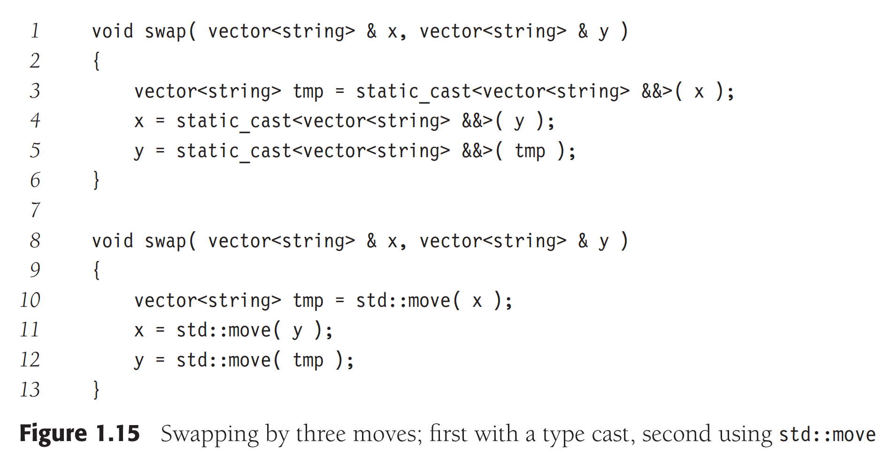

# Prerequisites
## `vector` and `string`
```cpp
// No {} before C++11
// use () to call constructor that takes size
vector<int> daysInMonth( 12 ); 

daysInMonth[ 0 ] = 31; daysInMonth[ 1 ] = 28; daysInMonth[ 2 ] = 31;
daysInMonth[ 3 ] = 30; daysInMonth[ 4 ] = 31; daysInMonth[ 5 ] = 30;
daysInMonth[ 6 ] = 31; daysInMonth[ 7 ] = 31; daysInMonth[ 8 ] = 30;
daysInMonth[ 9 ] = 31; daysInMonth[ 10 ] = 30; daysInMonth[ 11 ] = 31;
```
In C++, we can use:
```cpp
vector<int> daysInMonth = { 31, 28, 31, 30, 31, 30, 31, 31, 30, 31, 30, 31 };
```
e.g. If `squres` is an object of vector
```cpp
int sum = 0;
for( int i = 0; i < squares.size( ); ++i )
sum += squares[ i ];
```
it can compute the sum. However, C++11 adds a range for syntax for this purpose:
```
int sum = 0;
for( auto x : squares )
sum += x;
```
## lavlue and rvalue references
### Lvalue Reference
An lvalue reference then becomes a synonym (i.e., another name) for the object it references
e.g.
```cpp
string str = "hell";
string &rstr = str; 
// rstr is another name for str
```
### Rvalue Reference
```cpp
string str = "hell";
string && bad1 = "hello";           // Legal
string && bad2 = str + "";          // Legal
string && sub = str.substr( 0, 4 ); // Legal
```
My Example
```cpp
#include <iostream>
#include <vector>

using namespace std;

class Student {
    private:
        int age, grades;
    public:
        Student(int age, int grades) {
            this->age = age;
            this->grades = grades;
        }
        void print() const; 
};

void Student::print() const {
    cout << "age = " << age << endl;
    cout << "grades = " << grades << endl;
}

const Student & returnStudent(const Student & s) {
    return s;
}

int main(int argc, char const *argv[]) {
    Student s = Student(500, 100);
    const Student &s1 = returnStudent(s);
    // TIPS: 
    // You need to add 'const' in the tail of function 'print()' 
    // to make sure the object cannot be change in order to call
    // 'print()'
    // otherwise, compiler will complain when calling 'print()'
    // function.
    s1.print(); 
    return 0;
}
```
## std::move std::swap


Using `std::move` is more efficient in terms of big things.

# Copy Constructor and Move Constructor
Copy Constructor: Existing object is an lvalue.
Move Constructor: Existing object is an rvalue.
Take an `IntCell` object for example:
```cpp
IntCell B = C; // Copy construct if C is lvalue; Move construct if C is rvalue
IntCell B { C }; // Copy construct if C is lvalue; Move construct if C is rvalue
```
but not
```cpp
B = C; // We will discuss later.
```
The above is called Assignment Operator
```cpp
~IntCell();                                 // Destructor
IntCell(const IntCell &rhs);                // Copy Constructor
IntCell(IntCell && rhs);                    // Move Constructor
IntCell & operator=(const IntCell & rhs);   // Copy Assignment
IntCell & operator=(IntCell && rhs);        // Move Assignment
```
